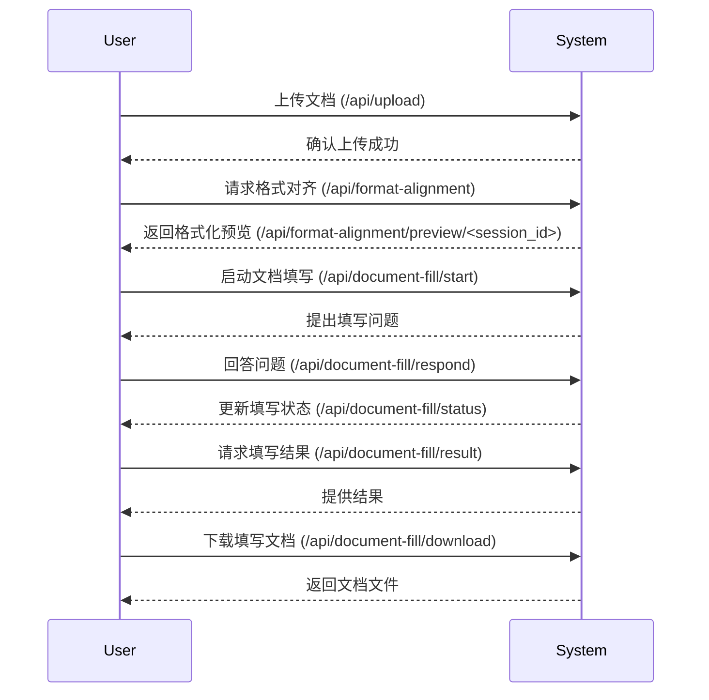
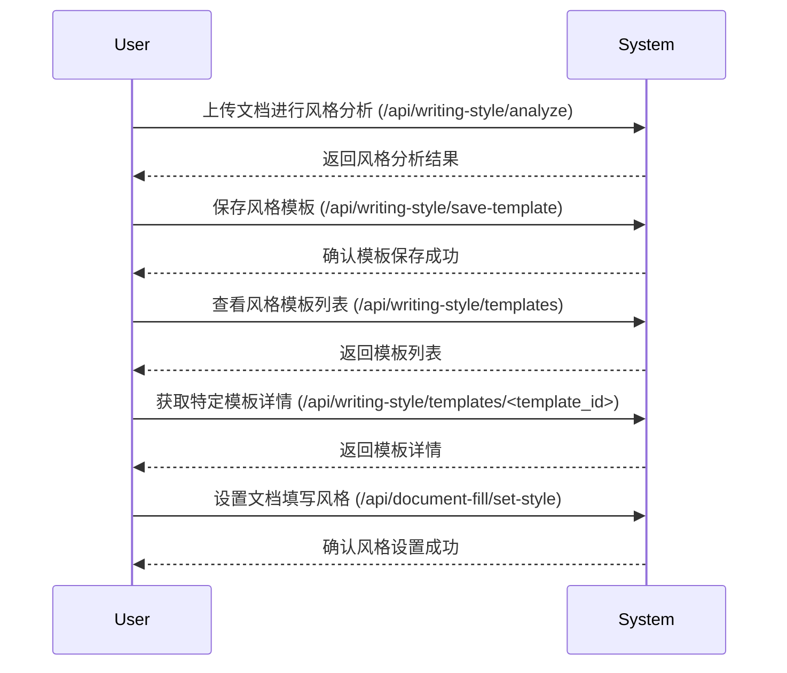
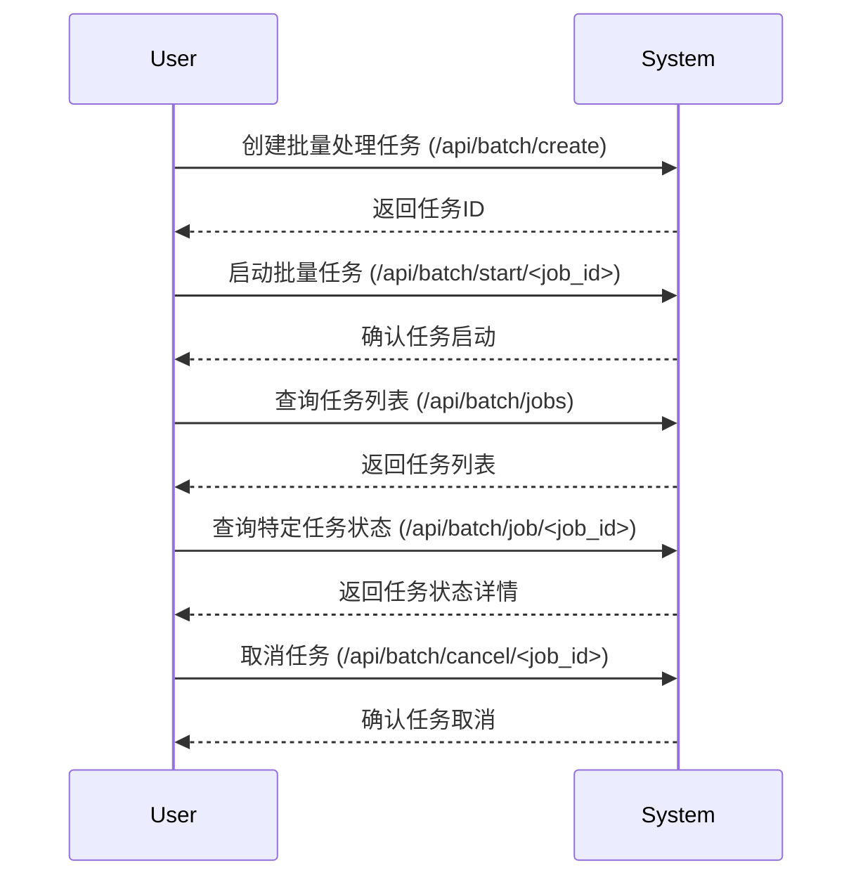
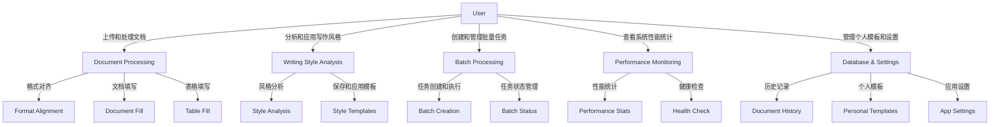

# 系统功能图表 (2025年6月26日)

## 📋 文档概述

本文档旨在通过交互流程图和用例图展示 Office-Doc-Agent 项目的系统功能，为项目团队提供直观的系统架构和功能交互参考。这些图表基于已实现的后台API接口和项目文档，涵盖了文档处理、写作风格分析、批量处理等主要功能模块。通过这些图表，团队成员可以更好地理解系统的操作流程和用户与系统之间的交互方式。

本文件包含了多个Mermaid格式的图表，用于描述系统的关键交互流程和用例场景。每个图表都附带了简要说明，以便于理解图表内容和功能背景。文档内容基于2025年6月26日的项目状态生成，未来如有功能变更，将更新相应版本。

## 📅 文档信息

本图表文档的生成时间为2025年6月26日，基于截至该日期的项目代码和文档信息。图表设计参考了"后端接口开发文档0626.md"中梳理的API端点，以及其他相关项目文件，确保内容的准确性和一致性。本文档遵循《项目开发规范》(v1.0, 2025年6月25日制定)中对技术文档的要求，旨在为项目团队提供清晰的视觉化参考。

在设计图表的过程中，重点考虑了系统的主要功能模块和用户交互场景，共生成了多个流程图和用例图，覆盖了从文档上传到结果下载的完整工作流。以下章节将逐一展示这些图表及其说明。

## 🏗️ 系统交互流程图

交互流程图展示了系统功能的主要操作流程，描述了用户与系统之间的步骤和数据流向。以下是针对不同功能模块设计的流程图，每个图表聚焦于一个主要功能场景。

### 文档处理交互流程图

此流程图描述了用户通过系统进行文档处理的基本流程，包括文档上传、格式对齐、文档填写和结果下载等步骤。流程图展示了用户操作和系统响应的交互顺序，帮助理解文档处理的全过程。

### 写作风格分析交互流程图

此流程图展示了用户进行写作风格分析的交互过程，包括上传文档、分析风格、保存模板等步骤。流程图突出了用户如何通过系统提取和应用写作风格。

### 批量处理交互流程图

此流程图描述了用户创建和执行批量处理任务的流程，包括任务创建、启动、状态查询和取消等操作。流程图展示了批量处理任务的生命周期。

## 📊 系统用例图

用例图展示了系统的主要功能模块以及用户与这些功能之间的关系。以下是用例图，涵盖了系统的核心功能和用户角色。

### 整体系统用例图

此用例图描述了用户与Office-Doc-Agent系统的核心功能模块之间的交互关系，包括文档处理、写作风格分析、批量处理、性能监控等功能。图中展示了不同用户角色如何使用系统的各项功能。

## 📖 图表说明与使用指南

上述交互流程图和用例图提供了对Office-Doc-Agent系统功能的直观展示，旨在帮助团队成员理解系统的操作流程和功能结构。交互流程图以时序方式展示了用户与系统之间的具体交互步骤，适合用于理解功能操作的详细过程。用例图则从更高层次展示了系统功能模块和用户角色之间的关系，适合用于系统架构设计和功能规划。

在使用这些图表时，建议开发人员和测试人员参考交互流程图来设计测试用例或API调用顺序，确保测试覆盖所有关键步骤。产品经理和文档负责人可以参考用例图来评估功能完整性或规划新功能。未来如需添加或修改图表内容，可直接在本文档中更新Mermaid代码，或通过工具生成新的图表。

## 📋 结论

本系统功能图表文档通过交互流程图和用例图直观展示了Office-Doc-Agent项目的核心功能和用户交互方式，覆盖了文档处理、写作风格分析、批量处理等主要模块。这些图表为团队成员提供了清晰的系统参考，有助于功能理解、测试设计和开发规划。

在未来的工作中，建议团队根据系统功能的扩展持续更新这些图表，确保其与实际实现保持一致。同时，可考虑将图表内容集成到用户手册或开发指南中，以提升文档的实用性和可访问性。

---
**文档人**: AI Assistant (Claude)  
**文档时间**: 2025年6月26日  
**版本**: v1.0  
**状态检测**: 已完成 (2025-06-26 09:43:00)  
**审核状态**: 待审核
