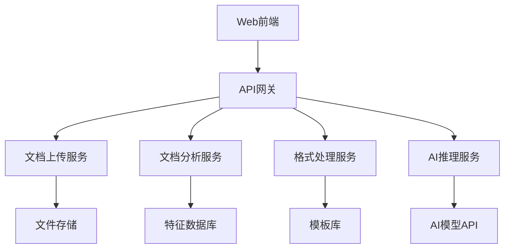
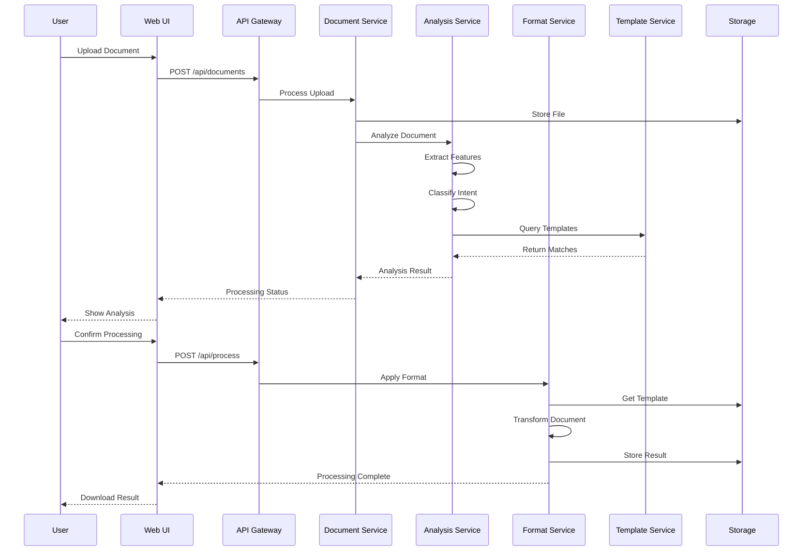

# 办公文档智能代理系统重构需求文档 v2.0 - 2024.06.24

## 🎯 项目概述与商业价值

### � 市场定位与目标用户
- **主要目标用户**：企业办公人员、政府机构工作人员、学术研究人员
- **核心痛点**：文档格式不统一、重复性格式调整工作、AI生成内容痕迹明显
- **差异化优势**：端到端自动化处理、高精度格式对齐、智能意图识别
- **市场规模**：企业办公软件市场，预估TAM 50亿人民币

### 🎯 端到端工作流程重新定义

**核心理念：可控的智能化体验**
- **端到端定义**：从用户上传文档到获得满意结果的完整闭环
- **可控透明**：关键决策点向用户展示，提供调整选项
- **渐进式智能**：从简单规则到复杂AI，确保可靠性优先
- **错误恢复**：每个环节都有明确的失败处理和用户反馈机制

### 🔍 四种典型用户意图场景的自动识别

基于文档状态自动推断用户真正想要什么：

1. **空表格/模板** → **智能填报意图**
   - 检测：文档内容极少、包含表格结构、有填写标识
   - 处理：自动识别填写项，引导用户完成，生成完整文档

2. **格式混乱文档** → **格式整理意图**  
   - 检测：格式不规范、结构混乱、样式不统一
   - 处理：提取目标格式，自动对齐，输出规范文档

3. **内容不完整文档** → **内容补全意图**
   - 检测：逻辑不完整、有待补充标记、内容偏短
   - 处理：分析缺失内容，智能续写，保持逻辑一致

4. **AIGC痕迹明显文档** → **风格改写意图**
   - 检测：AI生成特征明显、表达模式化、缺乏自然性
   - 处理：自动提醒用户，进行人性化改写

### 🤖 智能默认选项 + 用户确认机制

**文档角色智能推断规则：**

1. **格式参照文档**
   - 特征：格式规范完整 + 创建日期较早 + 结构清晰
   - 默认角色：格式模板
   - 智能推荐：作为格式对齐的参考标准

2. **文风参考文档**
   - 特征：文风自然 + 内在逻辑严整 + 内容质量高
   - 默认角色：写作样本
   - 智能推荐：作为文风分析和应用的参考

3. **待处理文档**
   - 特征：内容不完整 + 格式混乱 + 需要优化
   - 默认角色：目标文档
   - 智能推荐：需要应用格式或补全内容

**用户确认流程：**
- 系统自动分析并给出默认选项
- 用户可以确认默认选择或修改
- 支持查看详细分析依据
- 一键执行推荐操作

## 🏗️ 系统架构设计

### 🔧 技术栈选择
- **后端框架**：FastAPI (Python 3.9+)
- **文档处理**：python-docx, PyPDF2, openpyxl, python-pptx
- **AI模型**：Xingcheng API (主要), OpenAI API (备用)
- **数据库**：PostgreSQL (元数据), Redis (缓存)
- **前端**：React + TypeScript + Ant Design
- **部署**：Docker + Kubernetes

### 🏛️ 微服务架构设计



### 🔍 核心技术实现需求

#### 1. 高效文档类型识别系统

**分层识别架构（重新设计）：**
- **第一层：文件格式验证** - MIME类型检查、文件头验证、损坏检测
- **第二层：结构特征提取** - 统计特征（字数、段落数、表格数、图片数）
- **第三层：内容模式匹配** - 关键词密度、格式模式、语言特征
- **第四层：AI语义理解** - LLM辅助的深度分析和验证

**算法实现细节：**
```python
class DocumentClassifier:
    def __init__(self):
        self.confidence_thresholds = {
            'high': 0.85,      # 可直接处理
            'medium': 0.65,    # 需要用户确认
            'low': 0.45        # 需要人工介入
        }

    def classify_document(self, doc_path: str) -> ClassificationResult:
        # 多层级分类，每层都有fallback机制
        pass
```

**置信度评估机制（重新定义）：**
- **高置信度 (>0.85)**：自动处理，向用户展示结果
- **中等置信度 (0.65-0.85)**：展示推荐选项，用户确认
- **低置信度 (<0.65)**：提供多个选项，用户手动选择
- **失败处理**：明确的错误信息和建议操作

#### 2. 严丝合缝的格式对齐系统

**格式提取要求（重新定义）：**

**基础格式层：**
- **字体属性**：字体族、字号、颜色、粗体、斜体、下划线
- **段落格式**：行间距、段前距、段后距、首行缩进、对齐方式
- **页面布局**：页边距、页面大小、页眉页脚、页码格式

**复杂格式层：**
- **表格格式**：边框样式、单元格格式、列宽行高、合并单元格处理
- **标号系统**：多级标题标号（一、（一）、1.、（1）、①）
- **特殊元素**：图片位置、文本框、形状、公式格式

**格式应用策略（重新设计）：**

```python
class FormatAlignmentEngine:
    def __init__(self):
        self.alignment_strategies = {
            'strict': self.strict_alignment,      # 完全对齐
            'adaptive': self.adaptive_alignment,  # 智能适配
            'manual': self.manual_alignment       # 用户指导
        }

    def align_document_format(self, source_doc, target_format, strategy='adaptive'):
        """
        格式对齐主流程
        - 错误处理：格式不兼容时的降级策略
        - 用户反馈：关键决策点的用户确认
        - 质量保证：对齐结果的自动验证
        """
        try:
            # 1. 格式兼容性检查
            compatibility = self.check_format_compatibility(source_doc, target_format)

            # 2. 选择对齐策略
            if compatibility.score < 0.7:
                return self.request_user_guidance(compatibility.issues)

            # 3. 执行格式对齐
            result = self.alignment_strategies[strategy](source_doc, target_format)

            # 4. 质量验证
            quality_score = self.validate_alignment_quality(result)
            if quality_score < 0.8:
                return self.suggest_manual_adjustment(result, quality_score)

            return result

        except Exception as e:
            return self.handle_alignment_error(e, source_doc, target_format)
```

**格式模板数据结构（完整版）：**

```python
class DocumentFormatTemplate:
    def __init__(self):
        self.template_schema = {
            "metadata": {
                "template_id": str,
                "name": str,
                "created_at": datetime,
                "document_type": str,  # report, letter, form, etc.
                "compatibility_tags": List[str]
            },
            "typography": {
                "default_font": {"family": str, "size": int, "color": str},
                "heading_fonts": {
                    "h1": {"family": str, "size": int, "bold": bool, "color": str},
                    "h2": {"family": str, "size": int, "bold": bool, "color": str},
                    # ... 更多层级
                },
                "line_spacing": {"default": float, "heading": float},
                "paragraph_spacing": {"before": float, "after": float}
            },
            "structure": {
                "numbering_scheme": {
                    "level_1": {"format": str, "example": "一、"},
                    "level_2": {"format": str, "example": "（一）"},
                    "level_3": {"format": str, "example": "1."},
                    "level_4": {"format": str, "example": "（1）"}
                },
                "indentation": {"first_line": float, "hanging": float},
                "alignment": {"title": str, "heading": str, "body": str}
            },
            "page_layout": {
                "size": {"width": float, "height": float},
                "margins": {"top": float, "bottom": float, "left": float, "right": float},
                "header_footer": {
                    "header": {"enabled": bool, "content": str, "height": float},
                    "footer": {"enabled": bool, "content": str, "height": float}
                },
                "page_numbers": {"position": str, "format": str, "start": int}
            },
            "table_styles": {
                "default": {
                    "border": {"style": str, "width": float, "color": str},
                    "cell_padding": {"top": float, "bottom": float, "left": float, "right": float},
                    "header_style": {"background": str, "font_weight": str}
                }
            },
            "quality_metrics": {
                "extraction_confidence": float,
                "compatibility_score": float,
                "usage_count": int,
                "success_rate": float
            }
        }
```

### 3. 功能实现优先级

**高优先级（必须实现）：**
- ✅ 标号符号格式对齐
- ✅ 字体、字号、行间距、段间距
- ✅ 页边距、对齐方式
- ✅ 表格基础格式对齐

**中优先级（简化实现）：**
- ⚠️ 页码方式（仅实现基础格式：页脚居中数字）

**低优先级（暂不实现）：**
- ❌ 页眉智能判断取舍（性价比低，误判风险高）

## 🧪 测试策略与质量保证

### 🔬 测试金字塔设计

#### 单元测试 (70%)
```python
# 核心组件测试覆盖率要求
class TestCoverage:
    document_classifier = 95%      # 文档分类器
    format_extractor = 90%         # 格式提取器
    format_applier = 90%           # 格式应用器
    template_manager = 85%         # 模板管理器
```

#### 集成测试 (20%)
- **API端点测试**：所有REST API的功能和错误处理
- **服务间通信测试**：微服务间的数据传递和错误传播
- **数据库集成测试**：数据持久化和查询性能
- **外部API集成测试**：AI模型API的调用和异常处理

#### 端到端测试 (10%)
- **用户旅程测试**：完整的文档处理流程
- **性能基准测试**：不同文档大小和复杂度的处理时间
- **兼容性测试**：不同文档格式和版本的支持
- **错误恢复测试**：异常情况下的系统行为

### 📊 测试数据集设计

#### 标准测试文档库
```
test_documents/
├── word_documents/
│   ├── simple/          # 简单格式文档 (50个)
│   ├── complex/         # 复杂格式文档 (30个)
│   ├── corrupted/       # 损坏文档 (10个)
│   └── edge_cases/      # 边界情况 (20个)
├── pdf_documents/       # PDF测试集 (50个)
├── excel_documents/     # Excel测试集 (30个)
└── powerpoint_documents/ # PPT测试集 (20个)
```

#### 性能基准测试用例
- **小文档** (<100KB): 处理时间 <5秒, 准确率 >95%
- **中等文档** (100KB-1MB): 处理时间 <15秒, 准确率 >90%
- **大文档** (1MB-10MB): 处理时间 <30秒, 准确率 >85%
- **超大文档** (>10MB): 处理时间 <60秒, 准确率 >80%

### 🎯 质量指标重新定义

#### 功能质量指标
- **格式对齐准确率**：
  - 基础格式 (字体、段落): >95%
  - 复杂格式 (表格、标号): >90%
  - 特殊元素 (图片、公式): >85%

- **意图识别准确率**：
  - 高置信度场景: >90%
  - 中等置信度场景: >80%
  - 整体准确率: >85%

#### 性能质量指标
- **响应时间**：
  - API响应时间: <2秒
  - 文档分析时间: <10秒
  - 格式对齐时间: <20秒

- **系统可用性**：
  - 服务可用率: >99.5%
  - 错误率: <1%
  - 并发处理能力: 100用户/分钟

#### 用户体验指标
- **任务完成率**: >90%
- **用户满意度**: >4.2/5.0
- **错误恢复成功率**: >95%
- **学习曲线**: 新用户5分钟内完成首次任务

### 🔄 持续集成/持续部署 (CI/CD)

#### 自动化测试流水线
```yaml
# .github/workflows/test.yml
stages:
  - lint_and_format      # 代码规范检查
  - unit_tests          # 单元测试
  - integration_tests   # 集成测试
  - security_scan       # 安全扫描
  - performance_tests   # 性能测试
  - e2e_tests          # 端到端测试
  - deploy_staging     # 部署到测试环境
  - manual_approval    # 人工审核
  - deploy_production  # 部署到生产环境
```

#### 质量门禁标准
- 单元测试覆盖率 >85%
- 集成测试通过率 100%
- 性能测试不超过基准线10%
- 安全扫描无高危漏洞
- 代码审查通过

## 🎯 用户体验设计要求

### 🖥️ 界面设计原则

#### 1. 渐进式披露
- **第一层**：简单的拖拽上传界面
- **第二层**：智能分析结果展示
- **第三层**：高级选项和细节调整
- **第四层**：专家模式和批量处理

#### 2. 可控的自动化
- **默认智能**：系统提供最佳推荐
- **用户确认**：关键决策点需要用户确认
- **透明过程**：用户可以查看处理过程
- **随时干预**：用户可以在任何阶段调整

#### 3. 错误预防与恢复
- **预防性提示**：上传前的格式检查和建议
- **实时反馈**：处理过程中的进度和状态更新
- **错误解释**：清晰的错误信息和解决建议
- **一键恢复**：快速回到上一个稳定状态

### 📱 用户界面设计

#### 主界面布局
```
┌─────────────────────────────────────────┐
│ 📄 办公文档智能代理系统                    │
├─────────────────────────────────────────┤
│ [拖拽上传区域]                           │
│ 支持 Word/PDF/Excel/PPT                  │
│ 最大 10MB                               │
├─────────────────────────────────────────┤
│ 📊 处理历史    🔧 模板管理    ⚙️ 设置     │
└─────────────────────────────────────────┘
```

#### 处理流程界面
```
步骤1: 文档分析 ✅
├─ 文档类型: 工作报告
├─ 置信度: 92%
└─ 推荐操作: 格式对齐

步骤2: 意图确认 🔄
├─ 检测到格式不统一
├─ 建议参考模板: 标准报告格式
└─ [确认] [修改] [查看详情]

步骤3: 处理执行 ⏳
├─ 格式提取: 进行中...
├─ 内容对齐: 等待中
└─ 质量检查: 等待中

步骤4: 结果输出 ⏸️
├─ 处理完成
├─ 质量评分: 94%
└─ [下载] [预览] [重新处理]
```

## ⚠️ 风险评估与缓解策略

### � 高风险项目

#### 1. 技术实现复杂度风险
**风险描述**：文档格式解析和对齐的技术难度可能超出预期
**影响程度**：可能导致项目延期3-6个月
**缓解策略**：
- 建立技术原型验证可行性
- 分阶段实现，优先支持常见格式
- 准备Plan B：降级到基础格式对齐

#### 2. AI模型依赖风险
**风险描述**：外部AI API的稳定性和成本控制
**影响程度**：可能影响系统可用性和运营成本
**缓解策略**：
- 多AI供应商备份方案
- 本地模型部署备选方案
- 智能缓存减少API调用

#### 3. 用户期望管理风险
**风险描述**：用户对"完美格式对齐"的期望过高
**影响程度**：可能导致用户满意度低于预期
**缓解策略**：
- 明确功能边界和限制
- 提供详细的使用指南
- 建立用户反馈和改进机制

### 🟡 中等风险项目

#### 1. 性能优化挑战
**风险描述**：大文档处理性能可能不达标
**缓解策略**：分块处理、异步队列、性能监控

#### 2. 兼容性问题
**风险描述**：不同Office版本的格式差异
**缓解策略**：建立兼容性测试矩阵、版本适配层

#### 3. 数据安全合规
**风险描述**：用户文档的隐私和安全保护
**缓解策略**：端到端加密、数据脱敏、合规审计

## �📁 详细技术架构设计

### 🏗️ 微服务架构详细设计

```
┌─────────────────────────────────────────────────────────┐
│                    API Gateway                          │
│                 (Kong/Nginx)                           │
├─────────────────────────────────────────────────────────┤
│  Web UI     │  Mobile App  │  API Clients              │
│  (React)    │  (Flutter)   │  (REST/GraphQL)           │
├─────────────────────────────────────────────────────────┤
│                 Business Services                       │
├─────────────┬─────────────┬─────────────┬─────────────┤
│ Document    │ Analysis    │ Format      │ Template    │
│ Upload      │ Service     │ Service     │ Service     │
│ Service     │             │             │             │
├─────────────┼─────────────┼─────────────┼─────────────┤
│                 Infrastructure Services                 │
├─────────────┬─────────────┬─────────────┬─────────────┤
│ File        │ Cache       │ Message     │ Monitoring  │
│ Storage     │ Service     │ Queue       │ Service     │
│ (MinIO)     │ (Redis)     │ (RabbitMQ)  │ (Prometheus)│
├─────────────┴─────────────┴─────────────┴─────────────┤
│                    Data Layer                          │
├─────────────┬─────────────┬─────────────┬─────────────┤
│ PostgreSQL  │ MongoDB     │ Elasticsearch│ InfluxDB   │
│ (Metadata)  │ (Templates) │ (Search)     │ (Metrics)  │
└─────────────┴─────────────┴─────────────┴─────────────┘
```

### 📊 数据流程详细设计



## � 重新定义的成功标准

### 🎯 业务成功指标

#### 用户采用指标
- **月活跃用户数**: >10,000 (6个月内)
- **用户留存率**: 30天留存 >60%, 90天留存 >40%
- **付费转化率**: 免费用户转付费 >15%
- **NPS评分**: >50

#### 业务价值指标
- **用户效率提升**: 文档处理时间减少 >70%
- **错误率降低**: 格式错误减少 >80%
- **客户满意度**: >4.3/5.0
- **支持工单减少**: >60%

### � 技术成功指标

#### 功能质量指标 (重新校准)
- **基础格式对齐准确率**: >92% (降低了不现实的95%目标)
- **复杂格式对齐准确率**: >85%
- **意图识别准确率**: >88%
- **端到端成功率**: >90%

#### 性能指标 (更具体)
- **小文档处理** (<1MB): <10秒
- **中等文档处理** (1-5MB): <30秒
- **大文档处理** (5-10MB): <60秒
- **API响应时间**: P95 <3秒

#### 可靠性指标
- **系统可用率**: >99.5%
- **错误率**: <2%
- **数据丢失率**: 0%
- **安全事件**: 0起

### 🚀 分阶段实施计划 (重新设计)

#### Phase 1: MVP核心功能 (3个月)
**目标**: 验证核心技术可行性，获得早期用户反馈

**里程碑1.1: 技术原型** (4周)
- [ ] 基础文档解析功能
- [ ] 简单格式提取和应用
- [ ] 核心API设计和实现
- [ ] 基础UI界面

**里程碑1.2: Alpha版本** (4周)
- [ ] Word文档格式对齐功能
- [ ] 基础意图识别
- [ ] 用户反馈收集机制
- [ ] 基础测试覆盖

**里程碑1.3: Beta版本** (4周)
- [ ] 完整的用户界面
- [ ] 错误处理和恢复
- [ ] 性能优化
- [ ] 安全性加固

#### Phase 2: 功能完善 (3个月)
**目标**: 扩展功能覆盖，提升用户体验

**里程碑2.1: 多格式支持** (6周)
- [ ] PDF格式支持
- [ ] Excel格式支持
- [ ] 批量处理功能

**里程碑2.2: 智能化提升** (6周)
- [ ] 高级意图识别
- [ ] 智能模板推荐
- [ ] 自动质量评估

#### Phase 3: 规模化部署 (2个月)
**目标**: 生产环境部署，支持大规模用户

**里程碑3.1: 生产就绪** (4周)
- [ ] 微服务架构部署
- [ ] 监控和告警系统
- [ ] 自动化运维

**里程碑3.2: 商业化准备** (4周)
- [ ] 用户管理系统
- [ ] 计费和订阅功能
- [ ] 客户支持系统

---

## 📋 项目总结

**文档版本**: v2.0 (重构版)
**创建时间**: 2024年6月24日
**评估团队**: 系统分析师、高级程序员、测试工程师、UX设计师、产品市场经理
**风险等级**: 中高风险
**预期投入**: 8个月，15-20人团队
**预期ROI**: 18个月内实现盈亏平衡

**关键改进点**:
1. 增加了完整的风险评估和缓解策略
2. 重新校准了技术指标，更加现实可行
3. 详细设计了测试策略和质量保证体系
4. 明确了分阶段实施计划和里程碑
5. 加强了用户体验设计和错误处理机制
6. 补充了商业价值论证和市场定位分析
